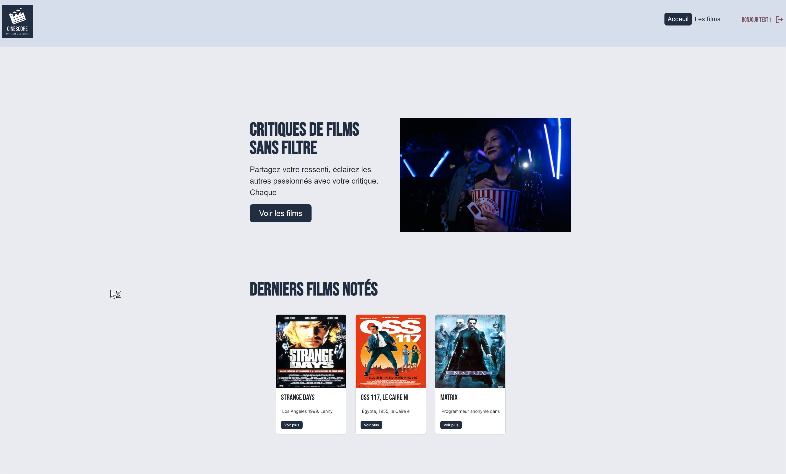
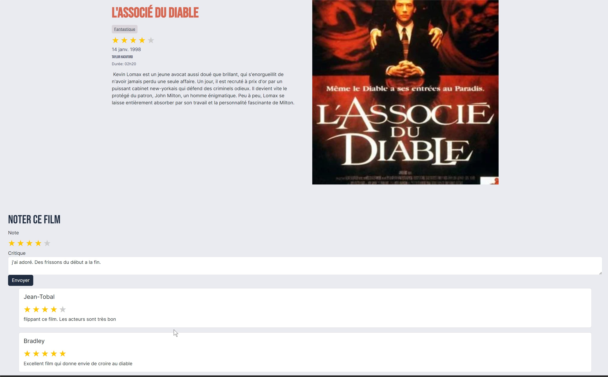

# CINESCORE


application de critique de films pour revoir les bases de SYMFONY

- register
- login
- logout
- admin movies/users/reviews
- post review by movie
  






## get started

```console
git clone https://github.com/Christophe-THEVENET/cinescore.git
```

```console
cd cinescore
```

```console
composer install
```

```console
npm install
```

```console
php bin/console c:c
```

```console
npm run build
```

```console
php bin/console doctrine:database:create
```

```console
php bin/console doctrine:migrations:migrate
```

!!!Attention il faut metttre à jour les url de reqûetes du front sur l'url locale ou créer un virtualhost

!!! Désactiver les protections ou créer un admin pour avoir accès au backoffice

